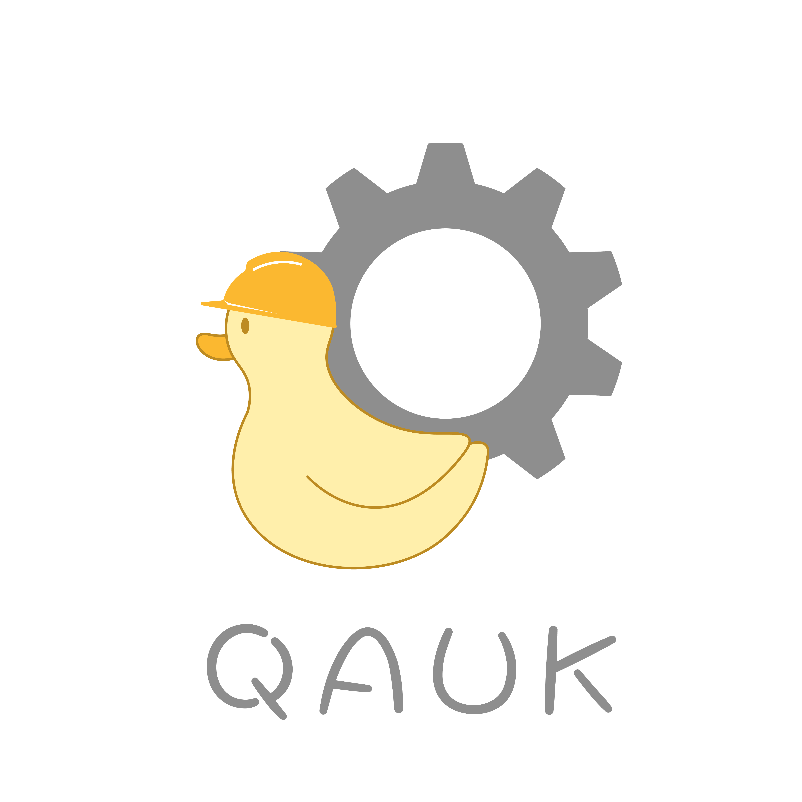

# Quak Framework

<picture>
  <source srcset="assets/quak_logo_dark.png" media="(prefers-color-scheme: dark)">
  <source srcset="assets/quak_logo_light.png" media="(prefers-color-scheme: light)">
  
</picture>

## Table Of Contents

- [Overview](#overview)
- [Application Lifecycle Hooks](#application-lifecycle-hooks)
- [Quak Modules Overview](#quak-modules-overview)
- [Dependency Injection](#dependency-injection)
- [Database Operations](#database-operations)
- [Quak Web](#quak-web)
- [Quak Security](#quak-security)

## Overview

An intuitive Java backend framework to quickly develop REST APIs. Features:
- Dependency injection
- Application lifecycle hooks
- Annotation-based HTTP request handling
- Code generation
- HTTP Authentication and Authorization
- Database operations

## Quak Modules Overview

Quak Framework is split into different modules depending on the needs of your application. The following is a table of each of the modules and their usage:

| Module                         | Usage                                                                                                                                                                                                                                                             |
|--------------------------------|-------------------------------------------------------------------------------------------------------------------------------------------------------------------------------------------------------------------------------------------------------------------|
| quak.framework.core            | Contains the core Quak functionality. Includes dependency injection, application lifecycle hooks, and application configuration.                                                                                                                                  |
| quak.framework.web             | Contains web functionality. Includes annotation-based REST controllers, function based REST controllers, request filtering functionality, and exception status code mapping.                                                                                      |
| quak.framework.web-model       | Contains model classes for HTTP requests, responses, and status codes.                                                                                                                                                                                            |
| quak.framework.data            | Contains database access functionality.                                                                                                                                                                                                                           |
| quak.framework.security        | Contains security functionality. Includes HTTP authorization, authentication, user principal management, and CORS configuration.                                                                                                                                  |
| quak.framework.generator       | A maven plugin for web controller and module-info generation. Before compilation, scans the project for classes with annotations from the quak.framework.generator-model module. These annotations give information to allow this plugin to generate controllers. |
| quak.framework.generator-model | Annotations for project classes and methods to give information for the quak.framework.generator maven plugin.                                                                                                                                                    |

## Application Lifecycle Hooks

Quak represents an application using the `io.john.amiscaray.quak.core.Application` class. This class includes functionality for application lifecycle hooks. Different phases of the application lifecycle are represented using the `LifecycleState` enum defined in the `Application` class. Callbacks can be added for each of these lifecycle states using the `Application#on` method. The following are the application lifecycle states and their meanings:

- `PRE_START` : Before the application starts.
- `CONTEXT_LOADED` : After the application context loads (see the section below on dependency injection).
- `POST_START` : After the application starts.
- `PRE_STOP` : Before the application stops.
- `POST_STOP` : After the application stops.

## Dependency Injection

Quak framework has a robust API for dependency injection. Quak implements dependency injection using a combination of constructor-based dependency injection, annotation-based dependency providers, JPMS service loading, and a application singleton holding the dependencies.

### Dependencies

Dependencies in Quak are internally represented using the `io.john.amiscaray.quak.core.di.dependency.ProvidedDependency` record. This contains the provided instance and a `io.john.amiscaray.quak.core.di.dependency.DependencyID`. The dependency ID contains a type for the instance and an optional String identifier in case you need multiple dependencies of the same type.

### ApplicationContext

`io.john.amiscaray.quak.core.di.ApplicationContext` is an application singleton used to access dependencies. It contains methods for testing for dependencies and retrieving them by either their type or their dependency ID. Additionally, it has functionality for aggregating dependencies into a list.

Quak resolves the application context at the start of your application's lifecycle. This means that it goes through all the dependencies and attempts to instantiate all of them. Quak provides an application lifecycle hook for when the application context is loaded called `CONTEXT_LOADED`. If Quak fails to instantiate any required dependencies, the application will fail.

### The DependencyProvider Interface

Dependencies are provided to Quak using the `io.john.amiscaray.quak.core.di.provider.DependencyProvider` interface. Whether you provide dependencies to the framework using an annotation-based approach or using JPMS service loading, dependency providers will be represented using this interface. This contains methods for retrieving the dependency ID of the dependency we are providing, retrieving the dependency IDs of the dependencies needed to instantiate this dependency, testing whether this dependency is required to start the application, retrieving an identifier of a list to aggregate this dependency to, and retrieving the provided dependency given the application context.

### Providing Dependencies Using Service Loading

Dependencies can be provided to application context using JPMS' service loading functionality. This can be done by implementing the above-mentioned DependencyProvider interface and adding a _provides_ statements in your application's module info.

> Note that your application needs a module-info.java file for Quak to provide some required dependencies for you (ex. quak.framework.data's DatabaseProxy). This can be generated for you using the quak.framework.generator maven plugin.

### Annotation-based Dependency Providers

Dependency providers can be implemented using an annotation-based approach. A dependency provider can be represented by any class annotated with `io.john.amiscaray.quak.core.di.provider.annotation.Provider` these classes can contain methods annotated with `io.john.amiscaray.quak.core.di.provider.annotation.Provide` saying that the return value will be added to the application context. At the beginning of your application's lifecycle, these providers will be used to implement the DependencyProvider interface, get instantiated and added to the application context, then provide additional dependency using these `@Provide` methods.

As alluded to earlier, a dependency provider is also added as a dependency to the application context. Thus, we can use constructor-based dependency injection to instantiate the provider using a constructor annotated with `io.john.amiscaray.quak.core.di.provider.annotation.Instantiate`. Any parameters must first be instantiated into the application context. Similarly, each `@Provide` method can accept arguments for instances in the application context.

### ManagedTypes

Application components that you can instantiate via constructor-based dependency injection are annotated with `io.john.amiscaray.quak.core.di.provider.annotation.ManagedType`. Like the annotation-based providers mentioned above, these can be instantiated via constructor using the `io.john.amiscaray.quak.core.di.provider.annotation.Instantiate` annotation. On application startup, these will be added to the application context.

## Database Operations

In Quak, database operations can be done using the `quak.framework.data` module. This module supports querying using abstractions over SQL or by directly writing queries.

### Database Configuration

To configure database access in your Quak application, you can set the following properties in your application's `application.properties` file:

- `hibernate.dialect`: The hibernate SQL dialect to use.
- `hibernate.connection.driver_class`: The database driver class to use.
- `hibernate.connection.url`: The connection URL to use.
- `hibernate.connection.username`: The database username.
- `hibernate.connection.password`: The database password.
- `hibernate.hbm2ddl.auto`: The hibernate.hbm2ddl.auto setting. Affects how tables are managed when starting and stopping the application.

### Database Proxy

At the core of Quak's database access is a class called `io.john.amiscaray.quak.data.DatabaseProxy`. This class contains methods for querying, testing if an entity exists by ID, and CRUD operations. `quak.framework.data` instantiates this class and adds it to the application context. In doing so, it initializes it using the above-mentioned properties from the application properties. The sections below will talk about the less intuitive details of this class (querying, updating, and deleting). The rest can be figured out by looking through the java docs for the class.

### Query API

The `DatabaseProxy` class offers a unique and semantically intuitive API for querying your database. Below is an example of what a simple query looks like:

```java
import io.john.amiscaray.quak.core.di.provider.annotation.Instantiate;
import io.john.amiscaray.quak.core.di.provider.annotation.ManagedType;
import io.john.amiscaray.quak.data.query.DatabaseProxy;
import io.john.amiscaray.quak.data.query.DatabaseQuery;

import static io.john.amiscaray.quak.data.query.QueryCriteria.*;

@ManagedType
public class Test {
    
    private final DatabaseProxy dbProxy;
    
    @Instantiate
    public Test(DatabaseProxy dbProxy) {
        this.dbProxy = dbProxy;
    }

    public List<Employee> fetchEmployeesNamedJohn() {
        return dbProxy.queryAll(
                Employee.class, DatabaseQuery.builder()
                        .withCriteria(valueOfField("name", is("John")))
                        .build());
    }
    
}
```
In the example above, `DatabaseProxy#queryAll` method accepts the type of the database entity being querying along with an instance of `io.john.amiscaray.quak.data.query.DatabaseQuery`. `DatabaseQuery` is a record wrapping a list of `io.john.amiscaray.quak.data.query.QueryCriteria` implementations. It has a builder class associated with it used to add criteria to it using the `DatabaseQueryBuilder#withCriteria` method. Next, the `QueryCriteria` interface is used to define criteria for the query (basically the equivalent of conditions in the _WHERE_ clause in an SQL _SELECT_ statement). The interface contains various static utility methods to help you create implementations of this interface semantically. In the example above, the expression `valueOfField("name", is("John"))` returns a `io.john.amiscaray.quak.data.query.QueryCriteria`. This query criteria checks that the value of the name column is _"John"_. If you look at the second argument we passed to this function (the expression `is("John")`), that expression returns an implementation of `io.john.amiscaray.quak.data.query.QueryCriteria provider`. This interface has a single method which returns a `QueryCriteria` given the name of a field. Essentially, the `valueOf` method accepts the name of the field and a `QueryCriteriaProvider` to pass that field name to to create our `QueryCriteria`. `QueryCriteria` provides various other static methods for `QueryCriteriaProvider`s you can pass to this method. Below, you'll find more example queries you can make with this API:

```java
import io.john.amiscaray.quak.core.di.provider.annotation.Instantiate;
import io.john.amiscaray.quak.core.di.provider.annotation.ManagedType;
import io.john.amiscaray.quak.data.query.DatabaseProxy;
import io.john.amiscaray.quak.data.query.DatabaseQuery;

import static io.john.amiscaray.quak.data.query.QueryCriteria.*;

@ManagedType
public class Test {
    
    private final DatabaseProxy dbProxy;
    
    @Instantiate
    public Test(DatabaseProxy dbProxy) {
        this.dbProxy = dbProxy;
    }

    public List<Employee> fetchEmployeesNamedJohn() {
        return dbProxy.queryAll(
                Employee.class, DatabaseQuery.builder()
                        .withCriteria(valueOfField("name", is("John")))
                        .build());
    }
    
    public List<Employee> fetchEmployeesWithIDBetween2And10() {
        return dbProxy.queryAll(
                Employee.class, DatabaseQuery.builder()
                        .withCriteria(valueOfField("id", isBetween(2, 10))) // inBetween is inclusive of the min and max
                        .build());
    }
    
    public List<Employee> fetchEmployeesWithIDGreaterThanOrEqualTo2AndLessThanOrEqualTo4() {
        return dbProxy.queryAll(Employee.class, DatabaseQuery
                .builder()
                .withCriteria(valueOfField("id", matchesAllOf(
                        isGreaterThanOrEqualTo(2),
                        isLessThanOrEqualTo(4)
                )))
                .build());
    }

    public List<Employee> fetchEmployeesWithNameContainingN() {
        return dbProxy.queryAll(
                Employee.class, DatabaseQuery.builder()
                        .withCriteria(valueOfField("name", contains("n")))
                        .build());
    }
    
}
```

### Deletion API

Similar to the Query API, `DatabaseProxy` has a `deleteAll` method to delete database entries using a `DatabaseQuery` object to determine what rows to delete. See the `DatabaseProxy` class for more details.

### Update API

Quak's `DatabaseProxy` class also has an API for updating rows in your database. Similar to the query API, you can pass a `DatabaseQuery` object to this API to specify which rows this update applies to. Then, you can pass the new value to set the field to:

```java
import io.john.amiscaray.quak.core.di.provider.annotation.Instantiate;
import io.john.amiscaray.quak.core.di.provider.annotation.ManagedType;
import io.john.amiscaray.quak.data.query.DatabaseProxy;
import io.john.amiscaray.quak.data.query.DatabaseQuery;

import static io.john.amiscaray.quak.data.update.UpdateExpression.*;
import static io.john.amiscaray.quak.data.query.QueryCriteria.*;

@ManagedType
public class Test {

    private final DatabaseProxy dbProxy;

    @Instantiate
    public Test(DatabaseProxy dbProxy) {
        this.dbProxy = dbProxy;
    }
    
    public void updateEmployeesWithDepartmentTechToDepartmentTechnology() {
        dbProxy.updateAll(Employee.class,
                "department",
                DatabaseQuery.builder()
                        .withCriteria(valueOfField("department", is("Tech")))
                        .build(),
                "Technology");
    }

}
```

Aside from that, Quak also allows you to pass expressions for more complex operations on the current value of the field. This is done using implementations of the `io.john.amiscaray.quak.data.update.UpdateExpression` interface. Like the `QueryCriteria` interface, this interface contains static utility methods to get implementations of this interface based on arguments you pass to it. For example, it has `add`, `subtract`, `multiply`, and `divide` methods which each accept a numeric value. These methods return an update expression used to perform each of these operations on the current value of the field using the passed operand. For example, we can add another method to our example above to multiply employee's salaries by 1.5 and add 5000:

```java
import io.john.amiscaray.quak.core.di.provider.annotation.Instantiate;
import io.john.amiscaray.quak.core.di.provider.annotation.ManagedType;
import io.john.amiscaray.quak.data.query.DatabaseProxy;
import io.john.amiscaray.quak.data.query.DatabaseQuery;

import static io.john.amiscaray.quak.data.update.UpdateExpression.*;
import static io.john.amiscaray.quak.data.query.QueryCriteria.*;

@ManagedType
public class Test {

    private final DatabaseProxy dbProxy;

    @Instantiate
    public Test(DatabaseProxy dbProxy) {
        this.dbProxy = dbProxy;
    }
    
    public void updateEmployeesWithDepartmentTechToDepartmentTechnology() {
        dbProxy.updateAll(Employee.class,
                "department",
                DatabaseQuery.builder()
                        .withCriteria(valueOfField("department", is("Tech")))
                        .build(),
                "Technology");
    }
    
    public void updateEmployeesSalaryMultiplyBy50PercentAndAdd5000() {
        dbProxy.updateAll(Employee.class, // No DatabaseQuery passed here means that this applies to all rows. Optionally, you can add the query criteria after the entity type.
                FieldUpdate.<Number>builder("salary")
                        .apply(multiply(1.5))
                        .apply(add(5000))
                        .build()
        );
    }

}
```
Check the `DatabaseProxy` class and the `UpdateExpression` interface for more details.

### Native Queries

In case you want to write SQL queries directly, you can do this using `DatabaseProxy`'s support for _hibernate native queries_. In the example below, we create a native query with parameters interpolated into the query:

```java
import io.john.amiscaray.quak.core.di.provider.annotation.Instantiate;
import io.john.amiscaray.quak.core.di.provider.annotation.ManagedType;
import io.john.amiscaray.quak.data.query.DatabaseProxy;
import io.john.amiscaray.quak.data.query.DatabaseQuery;

import static io.john.amiscaray.quak.data.update.UpdateExpression.*;
import static io.john.amiscaray.quak.data.query.QueryCriteria.*;

@ManagedType
public class Test {

    private final DatabaseProxy dbProxy;

    @Instantiate
    public Test(DatabaseProxy dbProxy) {
        this.dbProxy = dbProxy;
    }

    public void updateDepartmentToTech() {
        dbProxy.createMutationQueryThen("UPDATE Employee e SET e.department = :newDepartment",
                query -> query.setParameter("newDepartment", "Tech") // This lambda accepts the query object created from the SQL string above.
                        .executeUpdate());
    }
}
```

Similarly, `DatabaseProxy` has a method for native queries used for selection:

```java
import io.john.amiscaray.quak.core.di.provider.annotation.Instantiate;
import io.john.amiscaray.quak.core.di.provider.annotation.ManagedType;
import io.john.amiscaray.quak.data.query.DatabaseProxy;
import io.john.amiscaray.quak.data.query.DatabaseQuery;

import static io.john.amiscaray.quak.data.update.UpdateExpression.*;
import static io.john.amiscaray.quak.data.query.QueryCriteria.*;

@ManagedType
public class Test {

    private final DatabaseProxy dbProxy;

    @Instantiate
    public Test(DatabaseProxy dbProxy) {
        this.dbProxy = dbProxy;
    }

    public void updateDepartmentToTech() {
        dbProxy.createMutationQueryThen("UPDATE Employee e SET e.department = :newDepartment",
                query -> query.setParameter("newDepartment", "Tech") // This lambda accepts the query object created from the SQL string above.
                        .executeUpdate());
    }
    
    public void getEmployeesInTheTechDepartment() {
        dbProxy.createSelectionQueryThen("FROM Employee WHERE department = 'Tech'", Employee.class, query -> {
            var myResults = query.getResultList();
            // Do what you need to do with the results...
        });
    }
}
```

## Quak Web

Quak offers a feature-rich API for handling web requests using a `WebApplication` class. As mentioned above, Quak 
offers a `Application` class used to represent the running application. `quak.framework.web`'s `io.john.amiscaray.quak.web.application.WebApplication` extends this class to implement web-specific functionality. This is used to configure 
implementations of a `io.john.amiscaray.quak.web.controller.PathController` interface to handle requests to specific 
endpoints. As a developer, you can instantiate an instance of this `WebApplication` class yourself and pass it a 
configuration of `PathController`s to get your web application started. However, as the more useful approach, you 
can utilize an annotation-based approach (similar to Spring Boot) where you can define annotated controller classes and 
methods. Under the hood, the framework will then use your annotated classes and methods to configure a 
`WebApplication` for you. The sections below will cover this annotation-based approach as I figure this will be the 
approach you use most often.

### Quak Controllers

Similar to Spring Boot, Quak allows you to define web controllers using annotated classes and methods. Below is an example of a Quak controller implementing a CRUD API:

```java
package io.john.amiscaray.test.controllers;

import io.john.amiscaray.quak.core.di.provider.annotation.Instantiate;
import io.john.amiscaray.quak.http.request.DynamicPathRequest;
import io.john.amiscaray.quak.http.request.Request;
import io.john.amiscaray.quak.http.request.RequestMethod;
import io.john.amiscaray.quak.http.response.Response;
import io.john.amiscaray.test.models.StudentDTO;
import io.john.amiscaray.test.orm.StudentTableEntry;
import io.john.amiscaray.quak.data.DatabaseProxy;
import io.john.amiscaray.quak.web.controller.annotation.Controller;
import io.john.amiscaray.quak.web.handler.annotation.Handle;

import java.util.HashMap;
import java.util.List;

@Controller
public class StudentController {

    private DatabaseProxy databaseProxy;

    @Instantiate
    public StudentDTOController(DatabaseProxy databaseProxy) {
        this.databaseProxy = databaseProxy;
    }

    @Handle(method = RequestMethod.POST, path = "/studentdto")
    public Response<Void> saveStudentDTO(Request<StudentDTO> request) {
        var studentdto = request.body();
        var entity = StudentDTO.createDataEntry(studentdto);
        databaseProxy.persist(entity);

        var headers = new HashMap<String, String>();
        headers.put("Location", "/studentdto/" + entity.getId());

        return new Response(headers, 201, null);
    }

    @Handle(method = RequestMethod.GET, path = "/studentdto")
    public Response<List<StudentDTO>> getAllStudentDTO(Request<Void> request) {
        return Response.of(
            databaseProxy.queryAll(StudentTableEntry.class)
                .stream()
                .map(StudentTableEntry::createDTO)
                .toList()
        );
    }

    @Handle(method = RequestMethod.GET, path = "/studentdto/{id}Long")
    public Response<StudentDTO> getStudentDTO(DynamicPathRequest<Void> request) {
        try {
            var id = Long.parseLong(request.pathVariables().get("id"));
            var fetched = databaseProxy.fetchById(id, StudentTableEntry.class);

            if (fetched == null) {
                return new Response(404, null);
            }

            return Response.of(StudentTableEntry.createDTO(fetched));
        } catch (NumberFormatException e) {
            return new Response(404, null);
        }
    }

    @Handle(method = RequestMethod.DELETE, path = "/studentdto/{id}Long")
    public Response<Void> deleteStudentDTO(DynamicPathRequest<Void> request) {
        try {
            var id = Long.parseLong(request.pathVariables().get("id"));

            try {
                databaseProxy.delete(id, StudentTableEntry.class);
            } catch (IllegalArgumentException e) {
                return new Response(404, null);
            }

            return new Response(204, null);
        } catch (NumberFormatException e) {
            return new Response(404, null);
        }
    }

    @Handle(method = RequestMethod.PUT, path = "/studentdto/{id}Long")
    public Response<Void> putStudentDTO(DynamicPathRequest<StudentDTO> request) {
        try {
            var id = Long.parseLong(request.pathVariables().get("id"));

            var entity = StudentDTO.createDataEntry(request.body());
            entity.setId(id);
            var isUpdate = databaseProxy.put(entity, id, StudentTableEntry.class);

            if (isUpdate) {
                return new Response(204, null);
            } else {
                var headers = new HashMap<String, String>();
                headers.put("Location", "/studentdto/" + entity.getId());

                return new Response(headers, 201, null);
            }
        } catch (NumberFormatException e) {
            return new Response(404, null);
        }
    }

    @Handle(method = RequestMethod.PATCH, path = "/studentdto/{id}Long")
    public Response<Void> patchStudentDTO(DynamicPathRequest<StudentDTO> request) {
        try {
            var id = Long.parseLong(request.pathVariables().get("id"));

            var entity = StudentDTO.createDataEntry(request.body());
            entity.setId(id);
            var foundEntity = databaseProxy.patch(entity, id, StudentTableEntry.class);

            if (foundEntity) {
                return new Response(204, null);
            } else {
                return new Response(404, null);
            }
        } catch (NumberFormatException e) {
            return new Response(404, null);
        }
    }
    
}
```

In this example, each method handling web requests accepts some type of request and returns a response. Requests and 
responses have generic type arguments of the type of the request and response bodies respectively. Additionally, requests can contain path arguments which can be accessed using instances of `DynamicPathRequest`. These can be retrieved through maps with keys for the path variables and values corresponding to the parts of the actual URL. Path variables are defined in the `Handle` annotation's `path` parameter where path variable names are wrapped in curly brackets. The type of the path variable can be declared immediately after the closing curly bracket.

### Starting a Web Application

After defining controllers and handler methods, the following `main` method can be used to start your web application:

```java
package io.john.amiscaray.test;

import io.john.amiscaray.quak.web.application.WebStarter;

import java.util.concurrent.ExecutionException;
import java.util.concurrent.TimeUnit;
import java.util.concurrent.TimeoutException;


public class Main {
    public static void main(String[] args) throws ExecutionException, InterruptedException, TimeoutException {
        var application = WebStarter.beginWebApplication(Main.class, args)
                .get(10, TimeUnit.SECONDS);

        application.await();
    }
}
```

### WebConfig

Lastly, `quak.framework.web` provides a `WebConfig` class. This can be added to the application context for `quak.framework.web` to read to configure your web application. Currently, the only config this contains is a `exceptionHttpStatusMapping` map. This map associates exceptions with different HTTP response codes so that if your handler throws an exception, a specific HTTP response code can be returned.

## Quak Security

Quak offers a security module to allow you to secure your web application. The core of the security module is a group of interfaces you can use to define how you will manage user authentications and principal management. Aside from that, the module comes with configuration classes you can pass to the application context to configure you application security.

### User Authentication and Principal Management

To get started with `quak.framework.security`, you first need to implement the `io.john.amiscaray.quak.security.auth.Authenticator` interface. Using this interface, you define how your Quak application looks up user principles to authenticate them. This section will cover how to implement this interface and how to define a user principal. 

#### The Authenticator Interface

The `Authenticator` interface has a default `authenticate` method. This calls an unimplemented `lookupPrincipal` method, checks its return value is not null, then returns a `io.john.amiscaray.quak.security.auth.SimpleAuthentication` object. Thus, all you need to do is implement the `lookupPrincipal` method. This will require you to map a user in your database to a user principal. To do this, however, you need to define what a user principal is.

#### The Principal Interface

User principals in `quak.framework.security` are represented using a `io.john.amiscaray.quak.security.auth.principal.Principal` interface which only has a `getSecurityID` method. When you develop your Quak application, you will have to map a user in your database to an implementation of this class.

#### Registering Your Authenticator

Once you implement the `Authenticator` interface, you must add it to the application context. This `Authenticator` implementation should have a dependency name defined in the `io.john.amiscaray.quak.security.di.SecurityDependencyIDs.AUTHENTICATOR_DEPENDENCY` constant.

### Configuring an Authentication Strategy

Now that you have your `Authenticator` implemented and configured, you can configure an authentication strategy to configure how users will authenticate with your web API. This is done by adding a `io.john.amiscaray.quak.security.config.SecurityConfig` instance to the application context. This dependency should have a name defined in the `io.john.amiscaray.quak.security.di.SecurityDependencyIDs.SECURITY_CONFIG_DEPENDENCY_NAME` constant. This instance contains a `AuthenticationStrategy` field which is an enum containing the different types of authentication that Quak supports. Currently, this extends only to HTTP basic and JWT based authentication. For JWT authentication and authorization, Quak offers a `io.john.amiscaray.quak.security.auth.jwt.JwtUtil` class for creating and managing tokens.

### Configuring Endpoint Roles

To enforce authentication for URL paths, you can configure roles for accessing for your endpoints. You can do this using the `SecurityConfig`'s `securedEndpointRoles` map. This map has `io.john.amiscaray.quak.security.config.EndpointMapping` instances as keys and a list of `io.john.amiscaray.quak.security.auth.principal.role.Role` implementations as values. If you wish to secure an endpoint for any role or want to opt out of using roles, you can pass a list with a single role of `Role.any()`.

### Configuring CORS

To configure CORS for your URL paths, you can use the `SecurityConfig`'s `pathCorsConfigMap` map. This map has URL paths as keys and `io.john.amiscaray.quak.security.config.CORSConfig` instances as values.