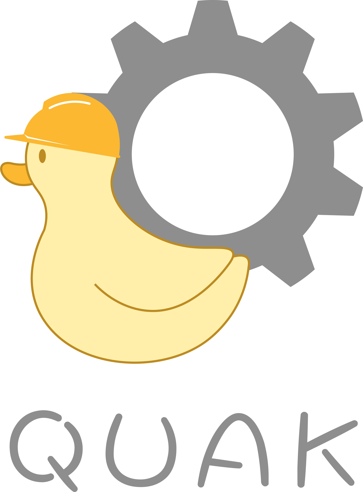

# Quak Framework

<picture>
  <source srcset="assets/logo/quak_logo_dark.png" media="(prefers-color-scheme: dark)">
  <source srcset="assets/logo/quak_logo_light.png" media="(prefers-color-scheme: light)">
  
</picture>

## Overview

An intuitive Java backend framework to quickly develop REST APIs. Features:
- Dependency injection
- Application lifecycle hooks
- Annotation-based HTTP request handling
- Code generation
- HTTP Authentication and Authorization
- Database operations

> While this project is still in its 1.0-SNAPSHOT version, please feel free to give feedback on the current state of it [here](https://forms.gle/8hzAeV2Ae1p9ksYcA).

## Quak Modules Overview

Quak Framework is split into different modules depending on the needs of your application. The following is a table of each of the modules and their usage:

| Module                                                       | Usage                                                                                                                                                                                                                                                                                                                                                                                  |
|--------------------------------------------------------------|----------------------------------------------------------------------------------------------------------------------------------------------------------------------------------------------------------------------------------------------------------------------------------------------------------------------------------------------------------------------------------------|
| [quak.framework.core](user-guide/quak_core.md)               | Contains the core Quak functionality. Includes dependency injection, application lifecycle hooks, and application configuration.                                                                                                                                                                                                                                                       |
| [quak.framework.web](user-guide/quak_web.md)                 | Contains web functionality. Includes annotation-based REST controllers, function-based REST controllers, request filtering functionality, and exception status code mapping.                                                                                                                                                                                                           |
| quak.framework.web-model                                     | Contains model classes for HTTP requests, responses, and status codes.                                                                                                                                                                                                                                                                                                                 |
| [quak.framework.data](user-guide/quak_data.md)               | Contains database access functionality.                                                                                                                                                                                                                                                                                                                                                |
| [quak.framework.security](user-guide/quak_security.md)       | Contains security functionality. Includes HTTP authorization, authentication, user principal management, and CORS configuration.                                                                                                                                                                                                                                                       |
| [quak.framework.generator](user-guide/quak_generator_api.md) | A maven plugin for web controller and module-info generation. Before compilation, scans the project for classes with annotations from the `quak.framework.generator-model` module. These annotations give information to allow this plugin to generate controllers. For module-info generation, automatically adds required declarations for dependency injection and web controllers. |
| quak.framework.generator-model                               | Annotations for project classes and methods to give information for the quak.framework.generator maven plugin.                                                                                                                                                                                                                                                                         |

View the [javadocs](https://john-amiscaray.github.io/QuakFramework/) for more info.

## Installation

> NOTE: Currently, Quak has only been released as a 1.0-SNAPSHOT version hosted via GitHub packages. When Quak has a full non-snapshot release, it will be hosted on maven central. Because Quak is only available on GitHub packages, you'll need extra setup beyond adding dependencies to your project's pom.xml.

1. Add the appropriate Quak modules as maven dependencies in your project's `pom.xml`. See the [project GitHub packages](https://github.com/john-amiscaray/QuakFramework/packages) for more details.
2. In your `pom.xml`, add the following repositories:
```xml
<repositories>
    <repository>
        <id>github</id>
        <url>https://maven.pkg.github.com/john-amiscaray/QuakFramework</url>
    </repository>
</repositories>

<pluginRepositories>
    <pluginRepository>
        <id>github</id>
        <url>https://maven.pkg.github.com/john-amiscaray/QuakFramework</url>
    </pluginRepository>
</pluginRepositories>
```
3. In your GitHub developer settings, generate a classic [personal access token](https://docs.github.com/en/authentication/keeping-your-account-and-data-secure/managing-your-personal-access-tokens) with at least the `read:packages` permission enabled.
4. In your maven settings file (either in your `~/.m2/settings.xml` file or a `settings.xml` file in your project's root folder) add the following to authenticate with GitHub packages:
```xml
<servers>
    <server>
        <id>github</id>
        <username>Your GitHub Username</username>
        <password>Your GitHub Personal Access Token</password>
    </server>
</servers>
```
If you are using a `settings.xml` file from your `~/.m2` folder, be sure to update your Maven settings in IntelliJ as follows:

